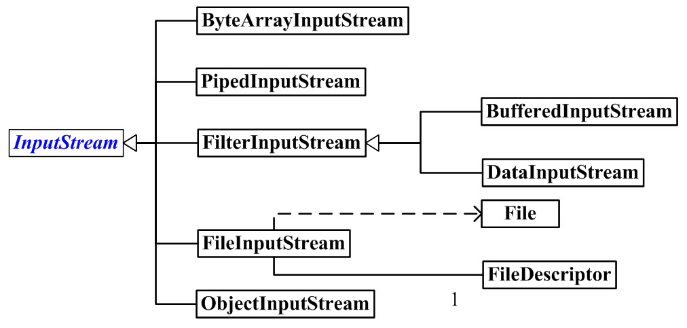
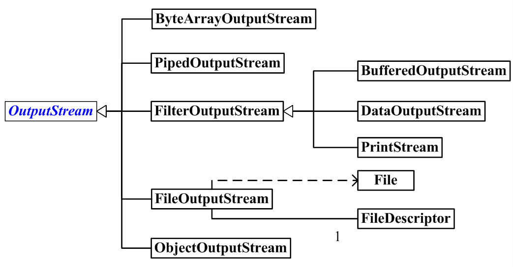

# IO编程

Java中，按照流的数据流向，可以氛围输入流和输出流。按照流处理数据的单位，可以将其区分为字节流和字符流。

## 1.字节输入流 <a id="1.&#x5B57;&#x8282;&#x8F93;&#x5165;&#x6D41;"></a>

字节输入流框架图



### 1.1InputStream <a id="1.1InputStream"></a>

InputStream是字节输入流的基类。

### 1.2ByteArrayInputStream <a id="1.2ByteArrayInputStream"></a>

构造函数

* ByteArrayInputStream\(byte\[\] buf\)
* ByteArrayInputStream\(byte\[\] buf, int offset, int length\)

方法

* int  read\(\)
* int  read\(byte\[\] b, int off, int len\)
* long    skip\(long n\)跳过n个字节

```java
    private static final int LEN = 5;
    // 对应英文字母“abcdefghijklmnopqrsttuvwxyz”
    private static final byte[] letters = {
            0x61, 0x62, 0x63, 0x64, 0x65, 0x66, 0x67, 0x68, 0x69, 0x6A, 0x6B, 0x6C, 0x6D, 0x6E, 0x6F,
            0x70, 0x71, 0x72, 0x73, 0x74, 0x75, 0x76, 0x77, 0x78, 0x79, 0x7A
    };

    public static void main(String[] args) throws IOException {
        ByteArrayInputStream bais = new ByteArrayInputStream(letters);
        byte[] bytes = new byte[5];
        int hasRead;

        while ((hasRead=bais.read(bytes))!=-1){
            System.out.println(new String(bytes,0,hasRead));
        }
    }
//fghij
//klmno
//pqrst
//uvwxy
//
```

### 1.3FileInputStream <a id="1.3FileInputStream"></a>

构造函数

* FileInputStream\(File file\)
* FileInputStream\(String name\) 
* FileInputStream\(FileDescriptor fdObj\)

方法

* int read\(\)
* int read\(byte\[\] b\):从输入流中读取最多b.length个字节的数据，并将其存储在字节数组中，返回实际读取的字节数。
* int read\(byte\[\] b,int off,int len\):从输入刘中读取最多len个字节数据，存入数组中。并不是从数组起点开始，而是从offset位置开始，返回实际读取的字节数。

```java
FileInputStream fis = null;
        try {
            fis = new FileInputStream("/Users/malinkang/Downloads/test.md");
            byte[] buf = new byte[1024];
            int hasRead = 0;
            while ((hasRead = fis.read(buf)) > 0) {// 返回-1读取完成
                System.out.println(new String(buf, 0, hasRead));
            }
        } catch (IOException e) {
            e.printStackTrace();
        } finally {
            try {
                fis.close();
            } catch (IOException e) {
                e.printStackTrace();
            }
        }
```

### 1.4BufferedInputStream <a id="1.4BufferedInputStream"></a>

BufferedInputStream 的作用是为另一个输入流添加一些功能，例如，提供“缓冲功能”以及支持“mark\(\)标记”和“reset\(\)重置方法”。

```java
 BufferedInputStream bis = null;
        try {
            bis = new BufferedInputStream(new FileInputStream("/Users/malinkang/Desktop/test.md"));
            byte[] bytes = new byte[1024];
            int hasRead = 0;
            while((hasRead=bis.read(bytes))!=-1){
                System.out.println(new String(bytes,0,hasRead));
            }
        } catch (FileNotFoundException e) {
            e.printStackTrace();
        } catch (IOException e) {
            e.printStackTrace();
        }finally {
            if(bis!=null){
                try {
                    bis.close();
                } catch (IOException e) {
                    e.printStackTrace();
                }
            }
        }
```

## 2.字节输出流 <a id="2.&#x5B57;&#x8282;&#x8F93;&#x51FA;&#x6D41;"></a>

字节输出流框架图



### 2.1OutputStream <a id="2.1OutputStream"></a>

OutputStream是字节输出流的基类。

### 2.2ByteArrayOutputStream <a id="2.2ByteArrayOutputStream"></a>

构造函数

* ByteArrayOutputStream\(\)
* ByteArrayOutputStream\(int size\)

### 1.3FileOutputStream <a id="1.3FileOutputStream"></a>

```java
    private static void fileOutputStreamTest() {
        FileInputStream fis = null;
        FileOutputStream fos = null;
        try {
            fis = new FileInputStream("/Users/malinkang/Downloads/test.md");
            fos = new FileOutputStream("/Users/malinkang/Downloads/test2.md");
            byte[] buf = new byte[1024];
            int hasRead = 0;
            while ((hasRead = fis.read(buf)) > 0) {
                fos.write(buf, 0, hasRead);
            }
        } catch (IOException e) {
            e.printStackTrace();
        } finally {
            try {
                fis.close();
                fos.close();
            } catch (IOException e) {
                e.printStackTrace();
            }
        }
    }
```

### 1.4BufferedOutputStream <a id="1.4BufferedOutputStream"></a>

## 3.File <a id="3.File"></a>

