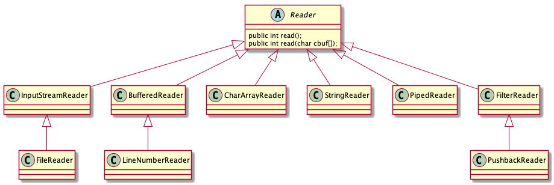
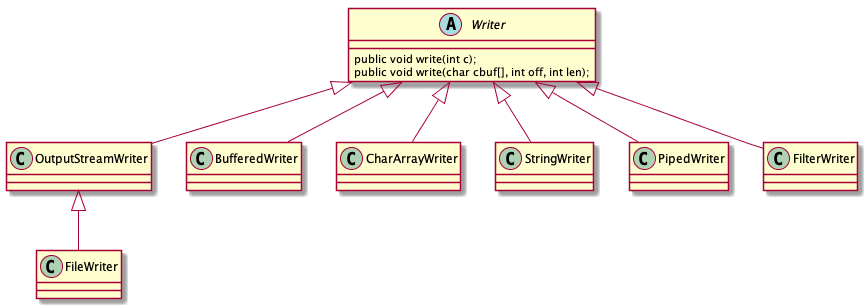
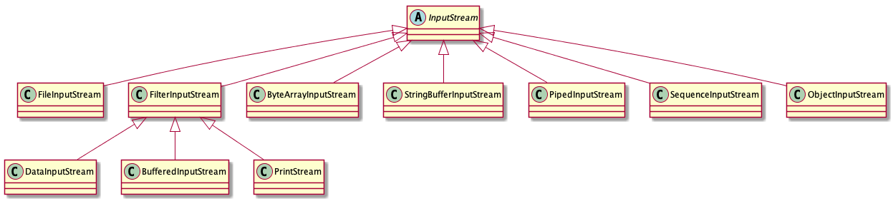
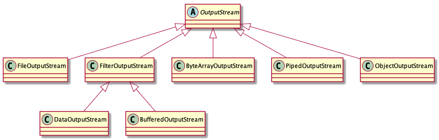

# I/O

## 字符流




### FileReader和FileWriter
```java
FileReader reader = null;
FileWriter writer = null;
try {
    reader = new FileReader(new File("a.txt"));
    writer = new FileWriter(new File("b.txt"));
    char[] buf = new char[1024];
    int len;
    while ((len=reader.read(buf))!=-1){
        writer.write(buf,0,len);
    }
} catch (IOException e) {
    e.printStackTrace();
    System.out.println("写入失败");
}finally {
    if(reader!=null){
        try {
            reader.close();
        } catch (IOException e) {
            e.printStackTrace();
        }
    }
    if(writer!=null){
        try {
            writer.close();
        } catch (IOException e) {
            e.printStackTrace();
        }
    }
}
```
### BufferedReader和BufferedWriter
```java
BufferedReader reader = null;
BufferedWriter writer = null;
try {
    reader = new BufferedReader(new FileReader("a.txt"));
    writer = new BufferedWriter(new FileWriter("b.txt"));
    String line;
    while((line=reader.readLine())!=null) {
        writer.write(line);
        writer.newLine();
    }
} catch (IOException e) {
    e.printStackTrace();
}finally {
    if(reader!=null){
        try {
            reader.close();
        } catch (IOException e) {
            e.printStackTrace();
        }
    }
    if(writer!=null){
        try {
            writer.close();
        } catch (IOException e) {
            e.printStackTrace();
        }
    }
}
```

### InputStreamReader和OutputStreamWriter

```java
FileInputStream in = null;
FileOutputStream out = null;
InputStreamReader reader = null;
OutputStreamWriter writer = null;
try {
    in = new FileInputStream("a.txt");
    out = new FileOutputStream("b.txt");
    reader=new InputStreamReader(in);
    writer = new OutputStreamWriter(out);
    char[] buf = new char[1024];
    int len;
    while ((len = reader.read(buf)) != -1) {
        writer.write(buf,0,len);
    }
} catch (IOException e) {
    e.printStackTrace();
}finally {
    if(reader!=null){
        try {
            reader.close();
        } catch (IOException e) {
            e.printStackTrace();
        }
    }
    if(writer!=null){
        try {
            writer.close();
        } catch (IOException e) {
            e.printStackTrace();
        }
    }
}
```

## 字节流




### FileInputStream和FileOutputStream

```java

FileInputStream in = null;
FileOutputStream out = null;
try {
    in = new FileInputStream(new File("test.txt"));
    out = new FileOutputStream(new File("test.txt"));
    byte[] buf = new byte[1024];
    int len;
    while ((len=in.read(buf) )!= -1) {
        out.write(buf,0,len);
    }
} catch (IOException e) {
    e.printStackTrace();
}finally {
    if(in!=null){
        try {
            in.close();
        } catch (IOException e) {
            e.printStackTrace();
        }
    }
    if(out!=null){
        try {
            out.close();
        } catch (IOException e) {
            e.printStackTrace();
        }
    }
}

```
## 标准IO

按照标准I/O模型，Java提供了`System.in`、`System.out`和`System.err`。`System.out`已经事先被包装成了`PrintStream`对象。`System.err`同样也是`PrintStream`，但`System.in`却是一个没有被包装过的未经加工的`InputStream`。

```java
BufferedReader stdin = new BufferedReader(new InputStreamReader(System.in));
String line;
while ((line=stdin.readLine())!=null){
    System.out.println(line);
}
```

## 新I/O

JDK1.4的`java.nio.*`包中引入了新的JavaI/O类库，其目的在于提高速度。速度的提高来自于所使用的结构更接近于操作系统执行I/O的方式：`通道和缓冲器`。我们并没有直接和通道交互：我们只是和缓冲器交互，并把缓冲器派送到通道。通道要么从缓冲器获得数据，要么向缓冲器发送数据。

```java
public class GetChannel {
    public static void main(String[] args) throws IOException {
        //getChannel()方法将会产生一个FileChannel
        FileChannel fc = new FileOutputStream("data.txt").getChannel();
        //使用wrap()方法将已存在的字节数组包装到ByteBuffer中
        fc.write(ByteBuffer.wrap("Some text".getBytes()));
        fc.close();
        fc = new RandomAccessFile("data.txt","rw").getChannel();

        fc.write(ByteBuffer.wrap("Some more".getBytes()));
        fc.close();
        fc = new FileInputStream("data.txt").getChannel();
        //对于只读访问，我们必须显式地使用静态的allocate()方法来分配ByteBuffer。
        ByteBuffer buff = ByteBuffer.allocate(1024);
        //一旦调用read()来告知FileChannel向ByteBuffer存储字节，就必须调用缓冲器上的flip()
        //让它做好让别人读取字节的准备。
        fc.read(buff);
        buff.flip();
        while (buff.hasRemaining()){
            System.out.println((char) buff.get());
        }
    }
}
```

```java
public class ChannelCopy {
    public static final int BSIZE = 1024;

    public static void main(String[] args) throws IOException {
        if (args.length != 2) {
            System.out.println("arguments:sourcefile destfile");
            System.exit(1);
        }
        FileChannel in = new FileInputStream(args[0]).getChannel();
        FileChannel out = new FileOutputStream(args[1]).getChannel();
        ByteBuffer buffer = ByteBuffer.allocate(BSIZE);
        while (in.read(buffer)!=1){
            buffer.flip();
            out.write(buffer);
            //如果打算使用缓冲器执行进一步的read()操作，
            //必须得调用clear()来为每个read()做好准备。
            buffer.clear();
        }

    }
}
```

```java
//特殊方法transferTo()和transferFrom()允许我们将一个通道和另一个通道直接相连
public class TransferTo {
    public static final int BSIZE = 1024;
    public static void main(String[] args) throws IOException {
        if (args.length != 2) {
            System.out.println("arguments:sourcefile destfile");
            System.exit(1);
        }
        FileChannel in = new FileInputStream(args[0]).getChannel();
        FileChannel out = new FileOutputStream(args[1]).getChannel();
        in.transferTo(0,in.size(),out);

    }
}
```

### 字节存放次序

不同的机器可能会使用不同的字节排序方法来存储数据。“big endian”（高位优先）将最重要的字节存放在地址最低的存储器单元。而“litte endian”（低位优先）则是将最重要的字节放在地址最高的存储单元。当存储量大于一个字节时，像int、float等。就要考虑字节的顺序问题了。`ByteBuffer`是以高位优先的形式存放数据的，并且数据在网上传送时也尝尝使用高位优先的形式。我们可以使用带有参数`ByteOrder.BIG_ENDIAN`或`ByteOrder.LITTLE_ENDIAN`的`order()`方法改变`ByteBuffer`的字节排序方式。

```java
public class Endians {
    public static void main(String[] args) {
        ByteBuffer bb = ByteBuffer.wrap(new byte[12]);
        bb.asCharBuffer().put("abcdef");
        System.out.println(Arrays.toString(bb.array()));
        bb.rewind();
        bb.order(ByteOrder.BIG_ENDIAN);
        bb.asCharBuffer().put("abcdef");
        System.out.println(Arrays.toString(bb.array()));
        bb.rewind();
        bb.order(ByteOrder.LITTLE_ENDIAN);
        bb.asCharBuffer().put("abcdef");
        System.out.println(Arrays.toString(bb.array()));
    }
}
/*
[0, 97, 0, 98, 0, 99, 0, 100, 0, 101, 0, 102]
[0, 97, 0, 98, 0, 99, 0, 100, 0, 101, 0, 102]
[97, 0, 98, 0, 99, 0, 100, 0, 101, 0, 102, 0]
 */
```

## 参考
* [Java NIO 系列教程](http://ifeve.com/java-nio-all/)
* [Java NIO系列教程（一） Java NIO 概述](http://ifeve.com/overview/)
* [Java NIO系列教程（二） Channel](http://ifeve.com/channels/)
* [Java NIO系列教程（三） Buffer](http://ifeve.com/buffers/)
* [Java NIO系列教程（四） Scatter/Gather](http://ifeve.com/java-nio-scattergather/)
* [Java NIO系列教程（五） 通道之间的数据传输](http://ifeve.com/java-nio-channel-to-channel/)
* [Java NIO系列教程（六） Selector](http://ifeve.com/selectors/)
* [Java NIO系列教程（七） FileChannel](http://ifeve.com/file-channel/)
* [Java NIO系列教程（八） SocketChannel](http://ifeve.com/socket-channel/)
* [Java NIO系列教程（九） ServerSocketChannel](http://ifeve.com/server-socket-channel/)
* [Java NIO系列教程（十） Java NIO DatagramChannel](http://ifeve.com/datagram-channel/)
* [Java NIO系列教程（十一） Pipe](http://ifeve.com/pipe/)
* [Java NIO系列教程（十二） Java NIO与IO](http://ifeve.com/java-nio-vs-io/)