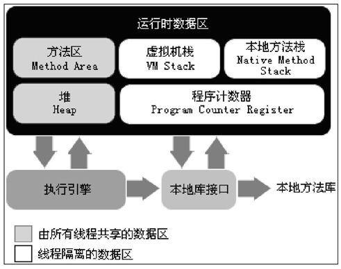

# 第1章 Java内存区域与内存溢出

## 1.1 概述

## 1.2 运行时数据区

Java虚拟机在执行Java程序的过程中会把它所管理的内存划分为若干个不同的数据区域。这些区域都有各自的用途，以及创建和销毁的时间，有的区域随着虚拟机进程的启动而存在，有些区域则依赖用户线程的启动和结束而建立和销毁。根据《Java虚拟机规范（Java SE 7版）》的规定，Java虚拟机所管理的内存将会包括以下几个运行时数据区域，如图所示。



### 1.2.1 程序计数器

`程序计数器（Program Counter Register）`是一块较小的内存空间，它可以看作是当前线程所执行的字节码的行号指示器。

### 1.2.2 Java虚拟机栈

每个方法在执行的同时都会创建一个`栈帧（Stack Frame)`用于存储局部变量表、操作数栈、动态链接、方法出口等信息。每一个方法从调用直至执行完成的过程，就对应着一个栈帧在虚拟机栈中入栈到出栈的过程。

局部变量表存放了编译期可知的各种基本数据类型（boolean、byte、char、short、int、float、long、double）、对象引用（reference类型，它不等同于对象本身，可能是一个指向对象起始地址的引用指针，也可能是指向一个代表对象的句柄或其他与此对象相关的位置）和returnAddress类型（指向了一条字节码指令的地址）。

在Java虚拟机规范中，对这个区域规定了两种异常状况：如果线程请求的栈深度大于虚拟机所允许的深度，将抛出StackOverflowError异常；如果虚拟机栈可以动态扩展（当前大部分的Java虚拟机都可动态扩展，只不过Java虚拟机规范中也允许固定长度的虚拟机栈），如果扩展时无法申请到足够的内存，就会抛出OutOfMemoryError异常。

### 1.2.3 本地方法栈

本地方法栈（Native Method Stack）与虚拟机栈所发挥的作用是非常相似的，它们之间的区别不过是虚拟机栈为虚拟机执行Java方法（也就是字节码）服务，而本地方法栈则为虚拟机使用到的Native方法服务。

### 1.2.4 Java堆

对于大多数应用来说，Java堆（Java Heap）是Java虚拟机所管理的内存中最大的一块。Java堆是被所有线程共享的一块内存区域，在虚拟机启动时创建。此内存区域的唯一目的就是存放对象实例，几乎所有的对象实例都在这里分配内存。

Java堆是垃圾收集器管理的主要区域，因此很多时候也被称做“GC堆”（Garbage Collected Heap）。从内存回收的角度来看，由于现在收集器基本都采用**分代收集算法**，所以Java堆中还可以细分为：**新生代**和**老年代**；再细致一点的有Eden空间、From Survivor空间、To Survivor空间等。从内存分配的角度来看，线程共享的Java堆中可能划分出多个线程私有的分配缓冲区（Thread Local Allocation Buffer，TLAB）。

### 1.2.5 方法区

方法区（Method Area）与Java堆一样，是各个线程共享的内存区域，它用于存储已被虚拟机加载的类信息、常量、静态变量、即时编译器编译后的代码等数据。

### 1.2.6 运行时常量池

`运行时常量池（Runtime Constant Pool）`是方法区的一部分。Class文件中除了有类的版本、字段、方法、接口等描述信息外，还有一项信息是常量池（Constant Pool Table），用于存放编译期生成的各种字面量和符号引用，这部分内容将在类加载后进入方法区的运行时常量池中存放。

### 1.2.7 直接内存

## 1.3 HotSpot虚拟机对象探秘

### 1.3.1 对象的创建

虚拟机遇到一条new指令时，首先将去检查这个指令的参数是否能在常量池中定位到一个类的符号引用，并且检查这个符号引用代表的类是否已被加载、解析和初始化过。如果没有，那必须先执行相应的类加载过程。

在类加载检查通过后，接下来虚拟机将为新生对象分配内存。对象所需内存的大小在类加载完成后便可完全确定，对象分配空间的任务等同于把一块确定大小的内存从Java堆中划分出来。假设Java堆中内存是绝对规整的，所有用过的内存都放在一边，空闲的内存放在另一边，中间放着一个指针作为分界点的指示器，那所分配内存就仅仅是把那个指针向空闲空间那边挪动一段与对象大小相等的距离，这种分配方式称为“指针碰撞”（Bump the Pointer）。如果Java堆中的内存并不是规整的，已使用的内存和空闲的内存相互交错，那就没有办法简单地进行指针碰撞了，虚拟机就必须维护一个列表，记录上哪些内存块是可用的，在分配的时候从列表中找到一块足够大的空间划分给对象实例，并更新列表上的记录，这种分配方式称为“空闲列表”（Free List）。选择哪种分配方式由Java堆是否规整决定，而Java堆是否规整又由所采用的垃圾收集器是否带有压缩整理功能决定。因此，在使用Serial、ParNew等带Compact过程的收集器时，系统采用的分配算法是指针碰撞，而使用CMS这种基于Mark-Sweep算法的收集器时，通常采用空闲列表。

除如何划分可用空间之外，还有另外一个需要考虑的问题是对象创建在虚拟机中是非常频繁的行为，即使是仅仅修改一个指针所指向的位置，在并发情况下也并不是线程安全的，可能出现正在给对象A分配内存，指针还没来得及修改，对象B又同时使用了原来的指针来分配内存的情况。解决这个问题有两种方案，一种是对分配内存空间的动作进行同步处理——实际上虚拟机采用CAS配上失败重试的方式保证更新操作的原子性；另一种是把内存分配的动作按照线程划分在不同的空间之中进行，即每个线程在Java堆中预先分配一小块内存，称为本地线程分配缓冲（Thread Local Allocation Buffer，TLAB）。哪个线程要分配内存，就在哪个线程的TLAB上分配，只有TLAB用完并分配新的TLAB时，才需要同步锁定。虚拟机是否使用TLAB，可以通过-XX:+/-UseTLAB参数来设定。

内存分配完成后，虚拟机需要将分配到的内存空间都初始化为零值（不包括对象头），如果使用TLAB，这一工作过程也可以提前至TLAB分配时进行。这一步操作保证了对象的实例字段在Java代码中可以不赋初始值就直接使用，程序能访问到这些字段的数据类型所对应的零值。

接下来，虚拟机要对对象进行必要的设置，例如这个对象是哪个类的实例、如何才能找到类的元数据信息、对象的哈希码、对象的GC分代年龄等信息。这些信息存放在对象的对象头（Object Header）之中。根据虚拟机当前的运行状态的不同，如是否启用偏向锁等，对象头会有不同的设置方式。关于对象头的具体内容，稍后再做详细介绍。

### 1.3.2 对象的内存布局

### 1.3.3 对象的访问定位

## 1.4 实战：OutOfMemoryError异常

```java
import java.util.ArrayList;
import java.util.List;
public class HeapOOM {
    static class OOMObject{}
    public static void main(String[] args) {
        List<OOMObject> list = new ArrayList<OOMObject>();
        while(true){
            list.add(new OOMObject());
        }
    }
}
```

```text
java -Xms20m -Xmx20m -XX:+HeapDumpOnOutOfMemoryError HeapOOM
```


### 1.4.1 Java堆溢出

### 1.4.2 虚拟机栈和本地方法栈溢出

### 1.4.3 方法区和运行时常量池溢出

### 1.4.4 本机直接内存溢出